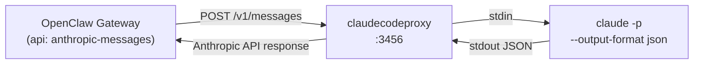
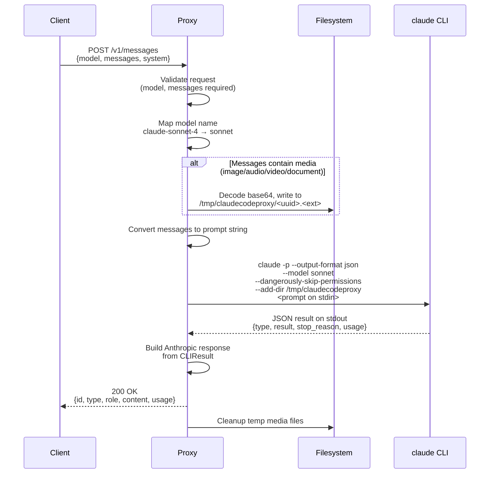
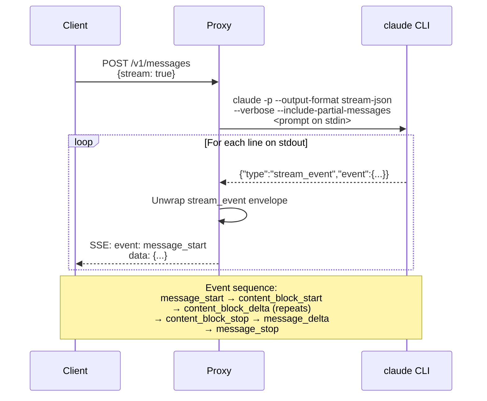
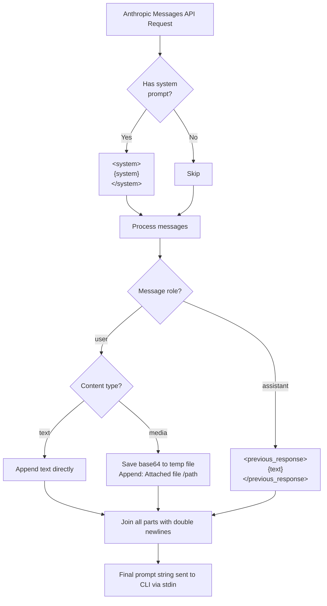
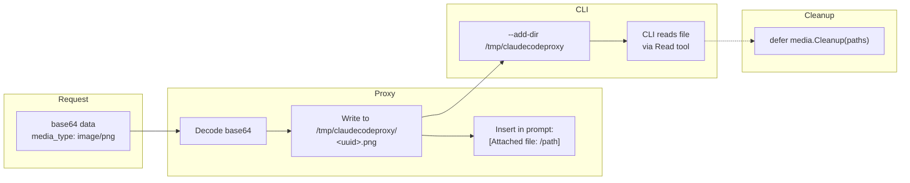
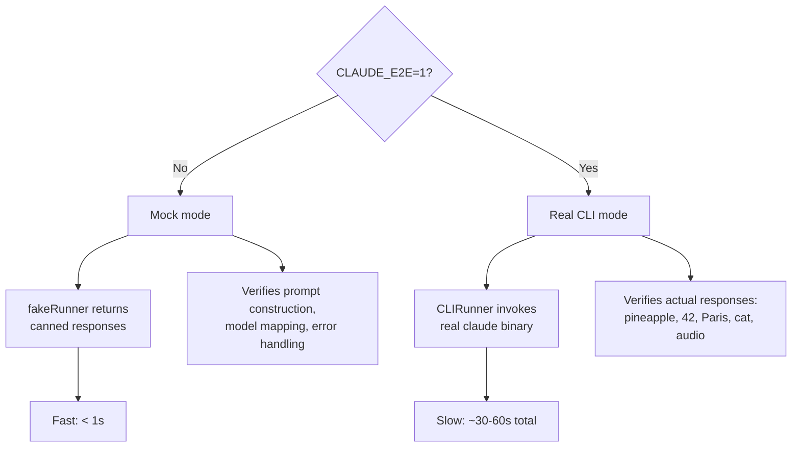

# Architecture: claudecodeproxy

## Overview

claudecodeproxy is an HTTP proxy that exposes an [Anthropic Messages API](https://docs.anthropic.com/en/api/messages) endpoint and fulfills requests by invoking the `claude` CLI under the hood. This lets OpenClaw (or any Anthropic API client) use a Claude Max subscription without needing an API key.



## Request lifecycle

### Non-streaming



### Streaming



The streaming path forwards the CLI's native Anthropic SSE events directly. The CLI emits events wrapped in a `stream_event` envelope; the proxy unwraps them and writes the inner event as a standard SSE frame.

## Message conversion

The proxy converts the Anthropic Messages API format into a single prompt string for the CLI's `--print` mode.



### Example

Given this API request:

```json
{
  "system": "You are helpful",
  "messages": [
    {"role": "user", "content": "Hello"},
    {"role": "assistant", "content": "Hi there!"},
    {"role": "user", "content": [
      {"type": "text", "text": "What's in this image?"},
      {"type": "image", "source": {"type": "base64", "media_type": "image/png", "data": "..."}}
    ]}
  ]
}
```

The CLI receives this prompt on stdin:

```
<system>
You are helpful
</system>

Hello

<previous_response>
Hi there!
</previous_response>

What's in this image?
[Attached file: /tmp/claudecodeproxy/a1b2c3d4-e5f6-7890-abcd-ef1234567890.png]
```

## Media handling

The Anthropic Messages API supports multi-modal content (images, audio, video, documents) as base64-encoded blocks. Since the CLI only accepts text on stdin, the proxy bridges this gap by saving media to disk and referencing the file path in the prompt.



The CLI is invoked with `--dangerously-skip-permissions` and `--add-dir /tmp/claudecodeproxy` so it can read the saved files without prompting. Temp files are cleaned up after each request via `defer`.

Supported MIME types map to file extensions:

| MIME type | Extension |
|---|---|
| image/png | .png |
| image/jpeg | .jpg |
| audio/wav | .wav |
| audio/mp3, audio/mpeg | .mp3 |
| video/mp4 | .mp4 |
| application/pdf | .pdf |
| (others) | subtype as extension |

## CLI invocation

The proxy invokes the `claude` binary with different flags depending on the mode:

| Mode | Command |
|---|---|
| Non-streaming | `claude -p --output-format json --model <m> --dangerously-skip-permissions [--add-dir <dir>]` |
| Streaming | `claude -p --output-format stream-json --verbose --include-partial-messages --model <m> --dangerously-skip-permissions [--add-dir <dir>]` |

- The prompt is always passed via **stdin** (not as a CLI argument) to avoid shell escaping issues and length limits.
- `--dangerously-skip-permissions` allows the CLI to read media files without interactive approval.
- `--add-dir` grants the CLI access to the temp media directory.
- `--verbose` and `--include-partial-messages` are required for stream-json to emit incremental `stream_event` frames with Anthropic SSE events.

### Non-streaming output

```json
{
  "type": "result",
  "subtype": "success",
  "is_error": false,
  "result": "Hello! How can I help?",
  "stop_reason": "end_turn",
  "usage": {
    "input_tokens": 100,
    "output_tokens": 25
  }
}
```

Mapped to the Anthropic response:

```json
{
  "id": "msg_a1b2c3d4e5f6...",
  "type": "message",
  "role": "assistant",
  "content": [{"type": "text", "text": "Hello! How can I help?"}],
  "model": "claude-sonnet-4",
  "stop_reason": "end_turn",
  "usage": {"input_tokens": 100, "output_tokens": 25}
}
```

### Streaming output

The CLI emits newline-delimited JSON, each line wrapped in a `stream_event` envelope:

```json
{"type": "stream_event", "event": {"type": "content_block_delta", "index": 0, "delta": {"type": "text_delta", "text": "Hello"}}}
```

The proxy strips the envelope and writes the inner `event` as a standard SSE frame:

```
event: content_block_delta
data: {"type":"content_block_delta","index":0,"delta":{"type":"text_delta","text":"Hello"}}

```

## Model mapping

| API model name | CLI `--model` flag |
|---|---|
| `claude-sonnet-4` | `sonnet` |
| `claude-opus-4` | `opus` |
| `claude-haiku-4` | `haiku` |

Unknown model names return a 400 error.

## Content unmarshaling

The Anthropic API allows the `content` field to be either a plain string or an array of content blocks:

```json
{"content": "Hello"}
{"content": [{"type": "text", "text": "Hello"}]}
```

The `Content` type has a custom `UnmarshalJSON` that handles both forms. A plain string is converted to a single text block internally, so the rest of the code always works with `[]ContentBlock`.

## Project structure

```
cmd/claudecodeproxy/
    main.go               # Cobra CLI: flags, env vars, server startup
  internal/
    types/
      request.go          # Anthropic request types, Content unmarshaler
      cliresult.go        # CLI JSON output types
    claude/
      models.go           # Model name mapping
      cli.go              # Runner interface, CLIRunner, subprocess management
    converter/
      messages.go         # Messages → CLI prompt string (with media extraction)
      response.go         # CLI result → Anthropic response
      stream.go           # stream_event unwrapping → SSE forwarding
    media/
      media.go            # Base64 decode, temp file save/cleanup
    server/
      server.go           # HTTP server, routing, logging middleware, graceful shutdown
      handlers.go         # /v1/messages and /health handlers
```

## Error handling

All errors are returned in the Anthropic error format:

```json
{
  "type": "error",
  "error": {
    "type": "invalid_request_error",
    "message": "model is required"
  }
}
```

| Condition | HTTP status | Error type |
|---|---|---|
| Invalid JSON body | 400 | invalid_request_error |
| Missing model | 400 | invalid_request_error |
| Missing messages | 400 | invalid_request_error |
| Unknown model | 400 | invalid_request_error |
| CLI execution failure | 500 | api_error |
| Media save failure | 500 | api_error |

## Configuration

| Source | Variable | Default | Description |
|---|---|---|---|
| Flag | `--port` / `-p` | 3456 | Listen port |
| Flag | `--host` | 127.0.0.1 | Bind address |
| Env | `PORT` | 3456 | Listen port (overridden by flag) |
| Env | `HOST` | 127.0.0.1 | Bind address (overridden by flag) |
| Env | `CLAUDE_CODE_OAUTH_TOKEN` | (required) | Claude CLI authentication |

Precedence: flags > env vars > defaults.

## Testing

Tests support two modes controlled by the `CLAUDE_E2E` environment variable:



- `go test ./...` -- mock mode, fast, tests all logic
- `CLAUDE_E2E=1 go test ./internal/server/ -timeout 180s` -- real CLI, validates end-to-end with actual Claude responses including image recognition and audio transcription
