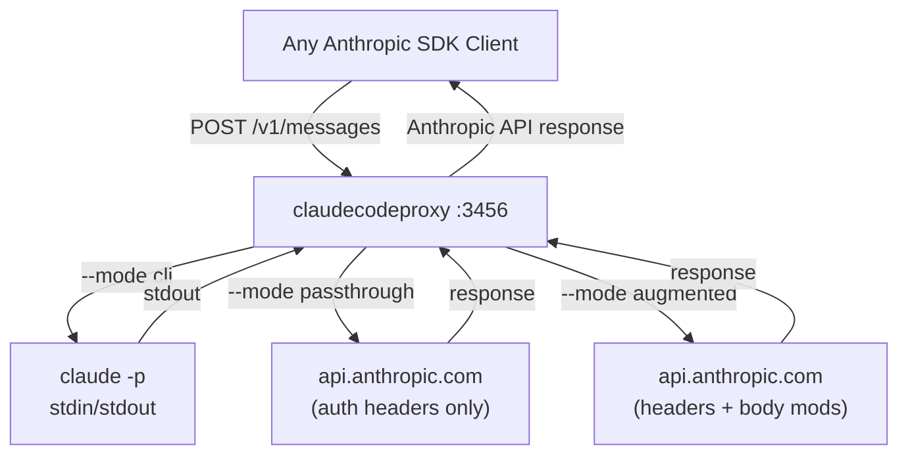
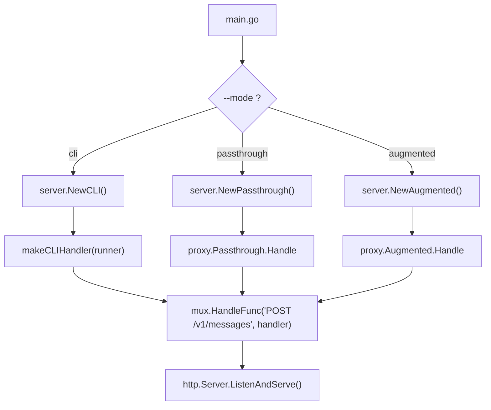
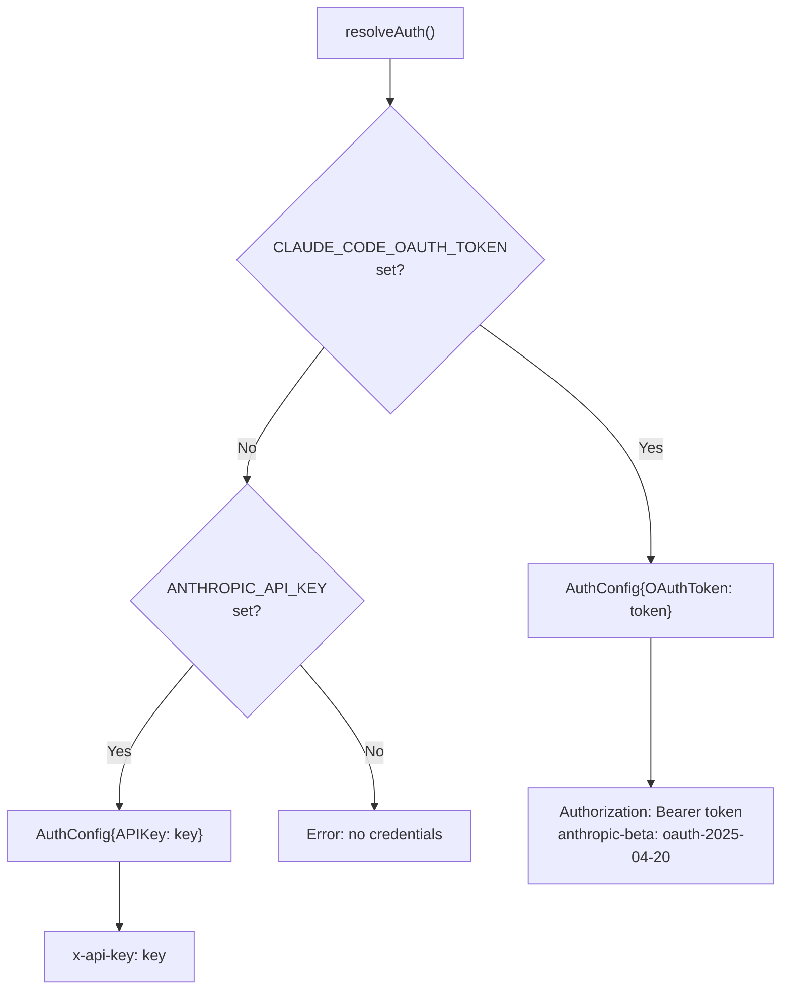
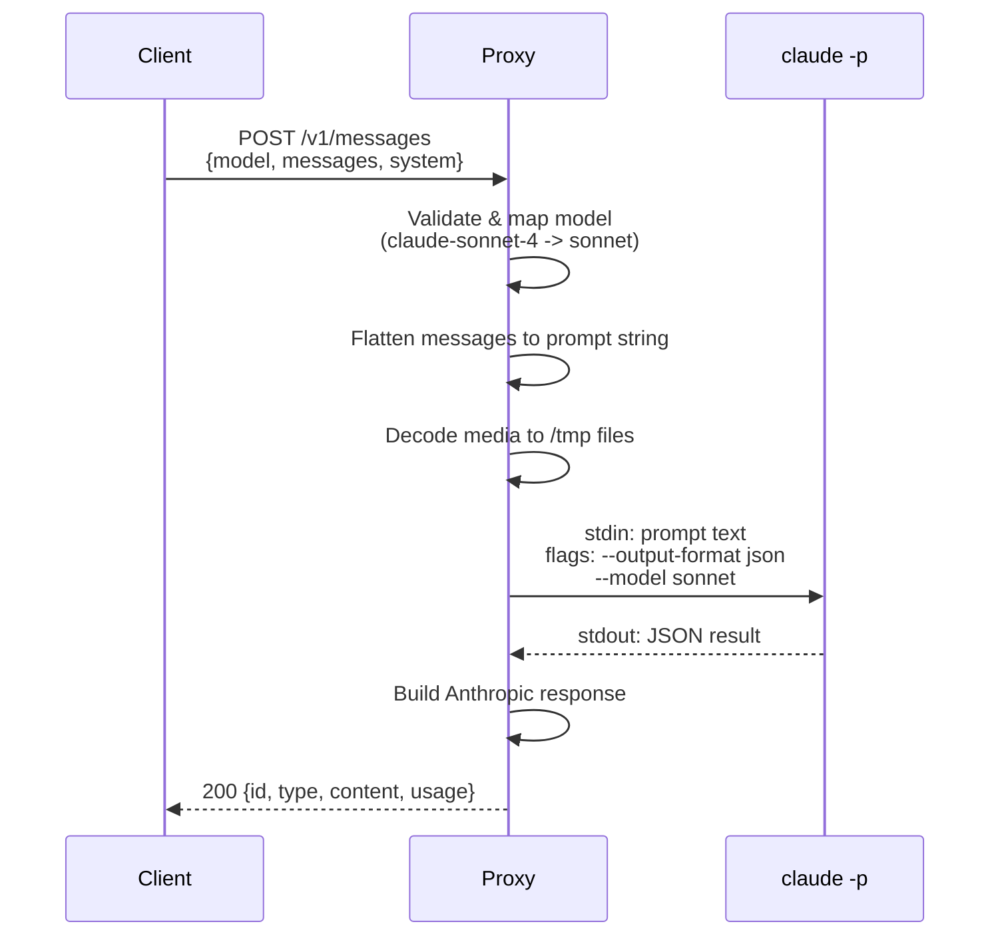
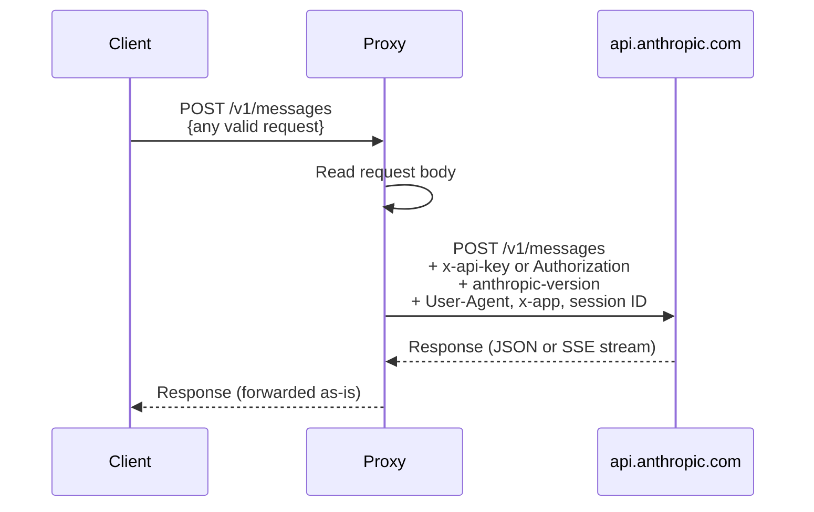
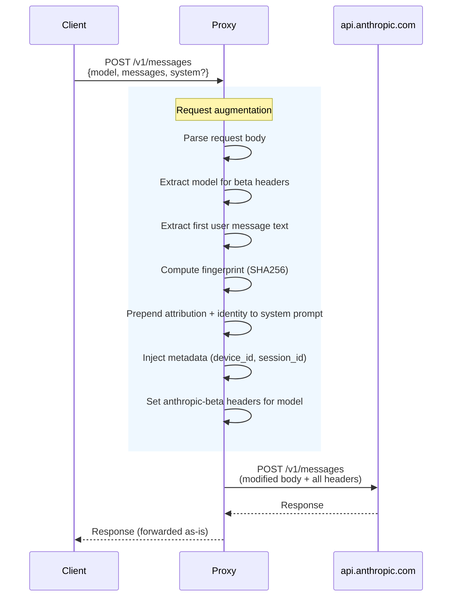
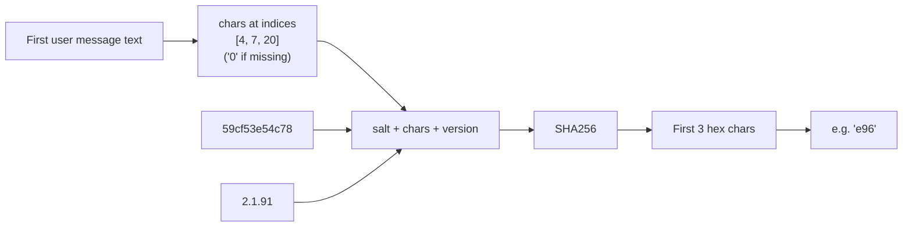
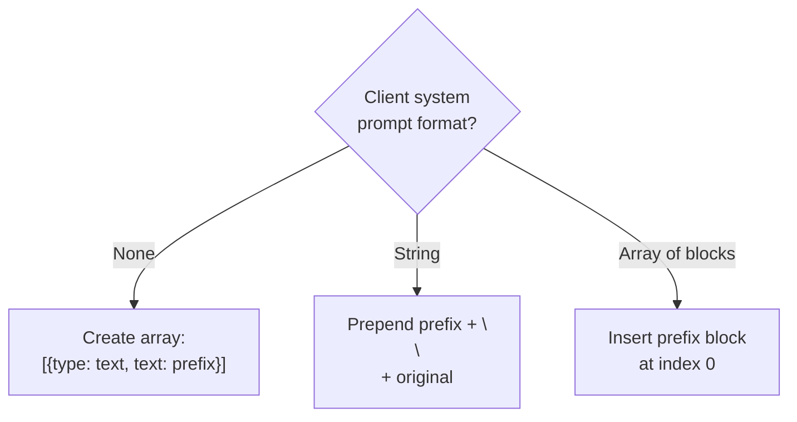
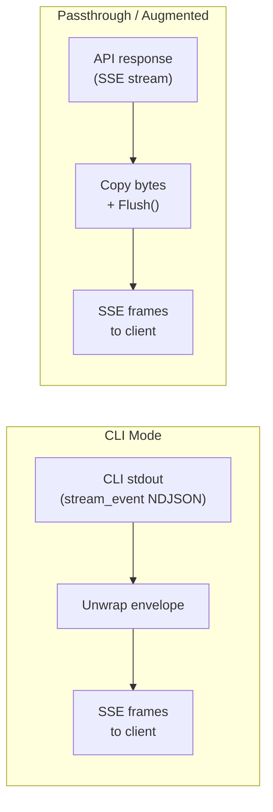
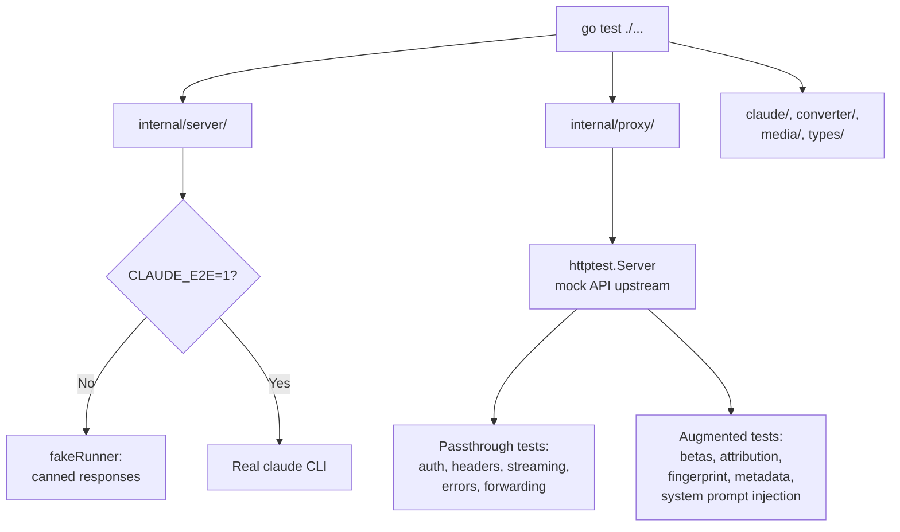

# Architecture: claudecodeproxy

## Overview

claudecodeproxy is an HTTP proxy that exposes an [Anthropic Messages API](https://docs.anthropic.com/en/api/messages) endpoint. It supports three operating modes:

| Mode | How it works | Use case |
|------|-------------|----------|
| **cli** | Shells out to `claude -p` | Use Claude Max subscription via CLI |
| **passthrough** | Reverse proxy to `api.anthropic.com` | Auth/billing proxy, no body modification |
| **augmented** | Reverse proxy + injects headers, attribution, metadata | Full Claude Code impersonation |



## Mode selection

The mode is selected via `--mode` flag or `MODE` env var. Each mode uses a different `messagesHandler` function mounted on the same HTTP server:



## Authentication

The proxy supports two auth methods, resolved from environment variables:



| Auth method | Header | Required beta | Source |
|------------|--------|---------------|--------|
| OAuth (Claude Max) | `Authorization: Bearer <token>` | `oauth-2025-04-20` | `CLAUDE_CODE_OAUTH_TOKEN` |
| API key | `x-api-key: <key>` | none | `ANTHROPIC_API_KEY` |

## Mode: CLI

The original mode. Converts the Anthropic Messages API request into a text prompt and shells out to the `claude` CLI.



**Limitations:**
- Messages are flattened to text (loses structured format)
- Only text responses (no tool_use blocks)
- temperature/max_tokens parsed but not forwarded
- Only 3 models supported (sonnet, opus, haiku)
- Process spawn overhead per request

## Mode: Passthrough

Pure reverse proxy. Forwards the request body unchanged to `api.anthropic.com`, injecting auth and identity headers.



**Headers injected:**

| Header | Value |
|--------|-------|
| `anthropic-version` | `2023-06-01` |
| `x-api-key` or `Authorization` | From auth config |
| `User-Agent` | `claude-cli/2.1.91 (external, cli)` |
| `x-app` | `cli` |
| `X-Claude-Code-Session-Id` | UUID (stable per proxy instance) |
| `x-client-request-id` | UUID (unique per request) |

Client-provided `anthropic-beta` headers are passed through and merged with any auth-required betas.

## Mode: Augmented

Builds on passthrough by also modifying the request body to match what the real Claude Code CLI sends. This includes the attribution header, system prompt prefix, beta headers, and metadata.



### Attribution header

Embedded as the first line of the system prompt (not an HTTP header):

```
x-anthropic-billing-header: cc_version=2.1.91.<fingerprint>; cc_entrypoint=cli;
You are Claude Code, Anthropic's official CLI for Claude.
```

### Fingerprint computation

Replicates the algorithm from `claude-code/utils/fingerprint.ts`:



### System prompt injection

The augmented handler prepends the attribution and identity prefix to whatever system prompt the client provided:



### Metadata injection

Added to the request body as:

```json
{
  "metadata": {
    "user_id": "{\"device_id\":\"<uuid>\",\"account_uuid\":\"\",\"session_id\":\"<uuid>\"}"
  }
}
```

### Beta headers (per model)

| Model family | Beta headers injected |
|-------------|----------------------|
| Claude 4+ (non-haiku) | `claude-code-20250219`, `interleaved-thinking-2025-05-14`, `context-management-2025-06-27` |
| Claude 4+ (haiku) | `interleaved-thinking-2025-05-14`, `context-management-2025-06-27` |
| Claude 3.x | `claude-code-20250219` |

## Streaming

All three modes support SSE streaming. The mechanism differs by mode:



- **CLI mode**: The CLI emits `{"type":"stream_event","event":{...}}` lines. The proxy unwraps the envelope and writes standard SSE frames (`event: ...\ndata: ...\n\n`).
- **Passthrough/Augmented**: The API responds with standard SSE. The proxy copies the response body to the client, flushing after each chunk for low-latency streaming.

## Project structure

```
cmd/claudecodeproxy/
    main.go                    # Cobra CLI: flags, env vars, mode selection
internal/
    proxy/
        proxy.go               # Passthrough handler, AuthConfig, streaming
        augmented.go            # Augmented handler: fingerprint, attribution, metadata, betas
    server/
        server.go              # HTTP server, mode-specific constructors, middleware
        handlers.go            # CLI mode handler (makeCLIHandler), health endpoint
    claude/
        cli.go                 # Runner interface, CLIRunner, subprocess + semaphore
        models.go              # Model name mapping (CLI mode only)
    converter/
        messages.go            # Messages -> CLI prompt string (CLI mode only)
        response.go            # CLI result -> Anthropic response (CLI mode only)
        stream.go              # stream_event unwrapping -> SSE (CLI mode only)
    media/
        media.go               # Base64 decode, temp file save/cleanup (CLI mode only)
    types/
        request.go             # Anthropic request types, Content unmarshaler
        cliresult.go           # CLI JSON output types
```

## Configuration

| Source | Variable | Default | Description |
|--------|----------|---------|-------------|
| Flag | `--mode` | `cli` | Proxy mode: cli, passthrough, augmented |
| Flag | `--port` / `-p` | 3456 | Listen port |
| Flag | `--host` | 127.0.0.1 | Bind address |
| Flag | `--max-concurrent` | 10 | Max concurrent CLI processes (cli mode) |
| Env | `MODE` | `cli` | Proxy mode (overridden by flag) |
| Env | `CLAUDE_CODE_OAUTH_TOKEN` | - | OAuth token (cli + proxy modes) |
| Env | `ANTHROPIC_API_KEY` | - | API key (proxy modes only) |
| Env | `ANTHROPIC_BASE_URL` | `https://api.anthropic.com` | Upstream API URL (proxy modes) |

Precedence: flags > env vars > defaults.

## Testing



- `go test ./...` -- all tests, mock mode (~1s)
- `CLAUDE_E2E=1 go test ./internal/server/ -timeout 180s` -- real CLI integration tests
